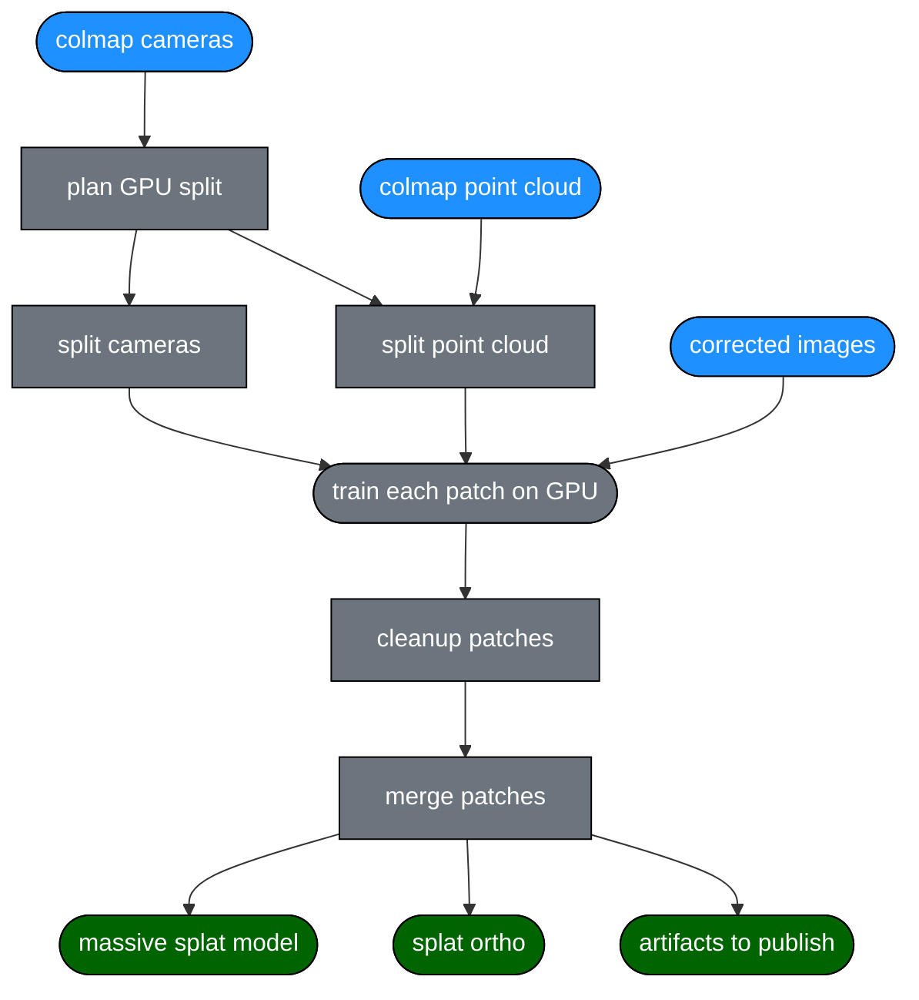

Extremely unstable library to work with coral reef splats.

You can swim with a few GoPros around a reef (e.g. [wildflow.ai/protocol](https://wildflow.ai/protocol)) and then turn the footage into 3D models (e.g. [wildflow.ai/demo](https://wildflow.ai/demo)) to track changes over time, run different analysis on top of it, and ultimately see which conservation/restoration methods work best.

# Installation

### From PyPI
```bash
pip install wildflow
```

### From GitHub (latest development version)
```bash
pip install git+https://github.com/wildflowai/splat.git
```

**Note**: Installing from GitHub requires Rust to be installed on your system.

## Flow



## Using the library
```py
from wildflow import splat

# split into multiple training patches so each patch fits into GPU VRAM
gpu_patches = splat.patches(cameras_2d, max_cameras=1400, buffer_meters=2)

# split colmap images.bin and cameras.bin into patches to train on GPU
splat.split_cameras({
    "input_path": input_path,
    "save_points3d": False, # we don't want tie points to see splats
    "patches": [
        {**patch, "output_path": f"{output_path}/p{i}/sparse/0"}
        for i, patch in enumerate(gpu_patches)
    ]
})

# use 5% of the dense point cloud to seed splat initial positions
splat.split_point_cloud({
    "input_file": input_path,
    "sample_percentage": 5,
    "patches": [
        {**coords(patch), "output_file": f"{output_path}/p{i}/sparse/0/points3D.bin"}
        for i, patch in enumerate(gpu_patches)
    ]
})

# train all patches on GPU

# get rid of wacky splats
splat.cleanup_splats(...)

# merge everything into one ply file
splat.merge_ply_files(...)

# create orthomosaic

# publish

```
